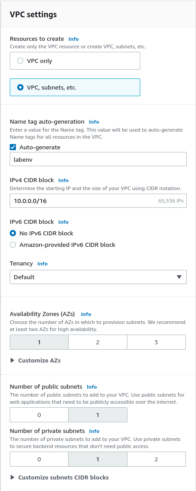

# Disconnected Ansible Automation Platform 2.1 on AWS

In this document we will outline the process of setting up an AWS environment and deploying Ansible Automation Platform 2.1 on a disconnected RHEL host. To do so we will be setting up a jump-box host that is on a public subnet as the intermediary for the private subnet which will contain our "disconnected" Ansible Automation Platform 2.1 Automation Controller.

## General Architecture

We will create a VPC to host our 2x Subnets. One subnet will be public and the other will be private. We will deploy our jump-box instance in the public subnet and the controller instance in the private subnet.

The jump-box will serve two purposes for this architecture. It will be our bastion to the private subnet (i.e. from our workstation we will ssh into the jump-box instance to then be able to ssh into the conroller instance from the jump-box). The jump-box will also serve as a webserver providing the required resources to the controller instance. The jump-box webserver will host two resources, making them available to the "disconnected" controller instance:

- Ansible Automation Platform setup bundle (installer), and
- a mirrored copy of the two Red Hat Enterprise Linux (RHEL) 8 repositories required for the installation process, namely the BaseOS and AppStream

These resources will be hosted on the jump-box instance using podman to run a conainterized httpd server.

On the (private) controller instance, we will need to edit the yum repos files to disable to default RHUI repository definitions and create two new repository definitions to instruct the controller host to utilize the repositories hosted on the jump-box.

From there we will pull the setup bundle (installer) to the controller instance, unpack it, edit the intaller inventory file, and run the installation.

Once the newly depolyed Ansible Automation Controller installation has completed we will utilize the `sshuttle` utility to create a tunneled connection to the private subnet so that we can access the Ansible Automation Controller web user interface from our workstation's browser.

## AWS Environment

For the purposes of this guide, we will be using the Red Hat (internal) Product Demo System's Open Envrionment. Under the services catalog, the "AWS Blank Open Environment" service is listed in the "Red Hat Open Environments" folder. Order your open environment and once you are logged into the AWS console you will have a clean AWS account to proceed forward with this guide.

## Step 1 - Virtual Private Cloud (VPC) setup

Open the "Services" catalog in the top left hand corner of the AWS Console and search for navigate to the "VPC" Service.


At the top of the VPC Dashboard click the "Launch VPC Wizard" button to begin creating our VPC and subnets.


On the "Create VPC" page in the "VPC Settings" column we will configure our VPC as follows:



|                           |                                              |
| ------------------------- | -------------------------------------------- |
| Resources to create       | Select "VPC, subnets, etc."                  |
|                           |                                              |
| Name tag auto-generation  |                                              |
| Auto-generate             | Enabled                                      |
|                           | Provide a name for your VPC (e.g. `aap_lab`) |
| IPv4 CIDR block           | Leave default (i.e. 10.0.0.0/16)             |
| IPv6 CIDR block           | Select "No IPv^ CIDR block (default)         |
| Tenency                   | Default                                      |
|                           |                                              |
| Availability Zones (AZs)  | 1                                            |
| Number of public subnets  | 1                                            |
| Number of private subnets | 1                                            |
| NAT gateways ($)          | None                                         |
| VPC endpoints             | None                                         |
|                           |                                              |
| DNS options               |                                              |
| Enable DNS hostname       | Enabled (not default)                        |
| Enable DNS resolution     | Enabled (default)                            |

Example:


! Take note of the IPv4 CIDR block. We will need this later in establishing our sshuttle tunnel into the VPC to access our deployed resources from our workstation.

Finally, click "Create VPC".


Once the "Create VPC workflow" has completed we can move on by clicking the "View VPC" button at the bottom of the page.


## Step 2 - EC2 Security Group

We will need to create a security group that limits the inbound and outbound traffic allowed to and from the RHEL instances we will be deploying. You can create a security group when you deploy an EC2 instance, but we are conducting this step beforehand to consolidate the process of creating one of the inbound rules. We will be defining two inbound rules in this security group. One rule allows for SSH traffic from anywhere. The other rule, which will have to be added after the security group has already been created, modifying the existing security group created in the first part of this section, to allow for all traffic originating from within the security group. In other words we are locking down the security group to allow for SSH traffic originating from anywhere, and allowing a host within the security group accept any kind of traffic from another host within the security group.

To begin, we will navigate to the AWS Console Service Catalog, search for and navigate to the EC2 Service page.


On the EC2 Dashboard we will navigate to the Security Group section from the "Resouces" card by clicking on the "Security Groups" link.


Once you reach the Security Groups dashboard, you will notice that there is already a default security group defined. We will leave that one as it is, and we will begin creating our own security group by clicking the "Create security group" button in the top right of the page.


On the "Create security group" page we will fill out the fields for "Security group name", "Description", and make sure that the automatically selected VPC is correct.

From there we will add a single Inbound rule by clicking the "Add rule" on the "Inbound rules" card. In fields for the newly created rule, in the "Type" column select "SSH" from the dropdown menu, and in the "Source" column select "Anywhere - IPv4" from the dropdown menu. You're newly created security group should look like the folowing before continuing by clicking the "Create security group" button at the bottom right of the page.


The second step is to modify or newly created `aap_lab_ssg` to allow all traffic from within the security group.
After creating the Security Group you will be taken to the `aap_lab_ssg` Security Group dashboard. To add another inbound rule, select the "Edit inbound rules" button on the "Inbound rules" card at the bottom of the page.


On the "Edit inbound rules" page, create a new rule by clicking "Add rule" and fill out the new rule "Type" with "All traffic" from the dropdown menu. In the "Source" column, select the security group `aap_lab_ssg` by clicking the magnifying glass and scrolling down until you find the correct security group. You're new rule should look similar to the below example, but note that the security group id will be different from the example.


Once you have completed editing the security group rules, proceed by clicking "Save rules" at the bottom of the page.

### Elastic IPs

- Go to Elastic IPs
- Allocate Elastic IP Addresses
- Use the standard/default options
- Allocate 1 Elastic IP

### Instances

Next we will begin depolying our EC2 instances.
Navigate to the EC2 Instances dashboard within the EC2 Service Dashboard"

#### Bastion Host


- Launch Instance
- Use the `ami-0b0af3577fe5e3532` ami images
  - This is a gold image provided by Red Hat
- t2.xlarge instace (4 vCPUs, 16 GiB Memory)
- Step 3: Configure Instance Details
  - Ensure it is in the correct VPC
  - Subnet: Ensure it is in the public subnet
  - Leave the reaminder of the options default
- Step 4:
  - Set 100 GiB of EBS
- Step 5: Add Tags
  - Key: Name; Value: mirror
- Step 6: Configure Security Group
  - Add rule for `All traffic` from anywhere
- Step 7: Create a keypair
  - ansible_mirror, type RSA
  - Download the keypair
- Launch the instance

- Go back to Elastic IPs,

  - Select the previously created Elastic IP
  - Actions drop down menu > "Allocate Elastic IP address"
    - Provide the instance
    - Provide the private IP address
    - Allocate

### Route 53 private hosted zone (optional)

- Create a private dns with route 53 (optional)

  - Hosted Zones

    - Create Hosted Zone
      - Domain name: lab.private
      - Make sure this is a `Private hosted zone`
      - Assign the private domain to the correct VPC
      - "Create"
    - Create records
      - We will be creating two A records within our private hosted zone. One for the bastion and one for the controller. If you do not have the _**private IPv4**_ addresses for you two newly created instances, take a moment to jump back over to the EC2 Instances dashboard and make a note of those now.
      - For each record we will configure them as follows:
        | | |
        |-|-|
        | Record name | The respective record name (i.e. either `bastion` or `controller`)
        | Record type | A record |
        | Value | the private IPv4 address of the instance |
      - Once you have filled in the above fields, contine by selecting "Create records"

    (Optional) Confirm the records
    On the bastion host:

    ```
    yum install bind-utils -y
    nslookup bastion.lab.private
    ```

### Key Pair

- Find your downloaded keypair. In my case it was located at `~/Downloads/aap_lab.pem`

- Move it to the ~/.ssh/ directory

  ```
  mv ~/Downloads/aap_lab.pem ~/.ssh/
  ```

- Set the required permissions on our keyfile:

  ```
  chmod 600 ~/.ssh/aap_lab.pem
  ```

- SSH into the instance

  ```
  ssh -i ~/.ssh/aap_lab.pem ec2-user@<bastion-public-ip>
  ```

- Prepare the host:

  > When you first login to the bastion host the prompt will not have a pretty hostname such as `[ec2-user@bastion]$`. The default behavior of the EC2 instance is to display the private ip address of the instance (e.g. `[ec2-user@ip-10.0.10.101]$ `). For the purposes of this guide, in an effort to ease following along with which host I am operating on for the commands and instructions documented below, I depict the prompt with a "pretty" hostname from the start. If you decide to set each instance's hostname (as documented below), your prompts will match the promts in this guide after setting the instance hostname, logging out, and then logging back into the each respective host.

  ```
  [ec2-user@bastion]$ sudo hostnamectl set-hostname bastion.lab.private
  [ec2-user@bastion]$ exit
  ...
  [user@workstation]$ ssh -i ~/.ssh/aap_lab.pem ec2-user@<bastion-public-ip>
  ...
  [ec2-user@bastion]$
  ```

  Install a few packages. We install `wget` for pulling the AAP 2.1 Setup Bundle installer from the Red Hat CDN directly to the bastion host, `podman` will allow us to run the containerized webserver, and `python3` is not strictly required, but will allow us to create an ssh tunnel with `sshuttle` from our workstation into the private VPC network so we can access the AAP 2.1 Automation Controller web user interface after we have completed the installation.

  ```
  [ec2-user@bastion]$ sudo yum install podman wget python3 -y
  [ec2-user@bastion]$
  ```

### Create the mirrored resources and webserver

On the bastion host create a `webserv` directory. We will store all of the recourses that our controller instance we need access to in this directory.

```
mkdir ~/webserv
```

Next we will run and configure the container for serving these resources.

First login to the `registry.redhat.io` container registry so we can pull the required container image.

```
podman login registry.redhat.io
```

Next we will run the container image, exposing port 8080, and mounting the `webserv` directory as a mounted volume inside of the container. Once the container runs successfully, we will delete the `/etc/httpd/conf.d/welcome.conf` inside of the container, and finally restart the container.

```
podman run -d --name httpd -p 8080:8080 --restart=always -v /home/ec2-user/webserv:/var/www/html:Z rhel8/httpd-24
podman exec -it httpd rm /etc/httpd/conf.d/welcome.conf
podman restart httpd
```

Ensure the container is up and running:

```
podman ps
```

Example output:

```
CONTAINER ID  IMAGE                                     COMMAND               CREATED         STATUS             PORTS                   NAMES
522788ae4e68  registry.redhat.io/rhel8/httpd-24:latest  /usr/bin/run-http...  40 minutes ago  Up 40 minutes ago  0.0.0.0:8080->8080/tcp  httpd
```

#### Prepare the AAP Bundle Installer

- Go to you access.redhat.com account, go to the downloads section for Ansible Automation Platform and locate the Ansible Automation Platform 2.1.x Setup Bundle.
- Right Click the `Download Now` and copy the link address to you clipboard.
- Then on the bastion host:

```
wget -O ~/webserv/setup-bundle.tar.gz -c "<the link you copied from the downloads page>"
```

#### Mirror the required RHEL 8 repositories

On the mirror host

```
sudo reposync -p ~/webserv/ --download-metadata --repo=rhel-8-baseos-rhui-rpms
sudo reposync -p ~/webserv/ --download-metadata --repo=rhel-8-appstream-rhui-rpms
```

#### AAP Instance

- Create another ec2 instace with the same process as before:
- t2.xlarge
- Put it in the private subnet
- Again 100 GiB volume
- Tag: {Name: aap2}
- Security Group:
  - All traffic from anywhere
  - Note, because it is in the private security group
- Associtate the same keypair
- Create instance

- Route 53
  - Add an A record `aap` pointing to the private IP of the aap instance

### Copy the keypair

From you workstation:

```
[user@workstation]$ scp ~/.ssh/aap_lab.pem ec2-user@<bastion-public-ip>:~/.ssh/
```

### SSH into AAP Host

- SSH into the bastion host, and then from there ssh into the controller host

```
[user@workstation]$ ssh -i ~/.ssh/aap_lab.pem ec2-user@<bastion-public-ip>
```

```
[ec2-user@bastion]$ ssh -i ~/.ssh/aap_lab.pem ec2-user@controller.lab.private
```

### Disable the default RHUI yum repos

Disable the default yum repos that point to the RHUI infrastructure. We will be defining our own repo file that points to the bastion instance, so we can run the following to disable all currently defined repos.

```
[ec2-user@controller]$ sudo sed -i 's/enabled=1/enabled=0/g' /etc/yum.repos.d/*.repo
```

Next we will create our own yum repo definitions as follows:

```
$ cat << EOF | sudo tee -a /etc/yum.repos.d/bastion-mirror.repo
[rhel-8-baseos-mirror]
name = Local Mirror of RHEL 8 BaseOS RPMs
baseurl = http://bastion.lab.private:8080/rhel-8-baseos-rhui-rpms/
enabled = 1
gpgcheck = 1
gpgkey=file:///etc/pki/rpm-gpg/RPM-GPG-KEY-redhat-release

[rhel-8-appstream-rhui-mirror]
name = Local Mirror of RHEL 8 AppStream RPMs
baseurl = http://bastion.lab.private:8080/rhel-8-appstream-rhui-rpms/
enabled = 1
gpgcheck = 1
gpgkey=file:///etc/pki/rpm-gpg/RPM-GPG-KEY-redhat-release
EOF
```

<!--- COMMENT START: old meathod, switching to using sed for disabling the repos and tee for creating a new repo file pointing to the bastion

```
sudo vi /etc/yum.repo.d/redhat-rhui.repo
:%s/enabled=1/enabled=0/gc
:wq
```

```
sudo vi /etc/yum.repo.d/redhat-rhui-client-config.repo
:%s/enabled=1/enabled=0/gc
:wq
```

```
sudo vi /etc/yum.repo.d/redhat-rhui.repo
```

COMMENT END -->

### Pull the setup bundle to the controller host

First we will install `wget` to confirm that the repos that we have mirrored onto the bastion host and configured on the controller host and to avoid having to utilize `curl` to pull the setup bundle from the bastion.

```
[ec2-user@controller]$ sudo yum install wget -y
```

Hopefully everything is configured correctly and you were able to install the wget package from the mirrored `rhel-8-appstream-rhui-mirror` repository. If not, please go back figure out where you may have made a mistake.

> In the event that your mirrors are not configured correctly, check to make sure that you are allowing all traffic initiation within the security group as an inbound traffic rule for the security group for the hosts. Additionally, check to make sure that the container is running on the bastion host `[ec2-user@bastion]$ podman ps`. And make sure that there are files in the directory we specified for the container mounted volume `[ec2-user@bastion]$ ls ~/webserv/`. Beyond those tips, there are a number of ways things could have gone wrong, so do you best to diagnose and troubleshoot.

With `wget` installed we can not retrieve the AAP 2.1 setup bundle (installer).

```
[ec2-user@controller]$ wget http://bastion.lab.private:8080/setup-bundle.tar.gz
[ec2-user@controller]$ tar xvf setup-bundle.tar.gz
[ec2-user@controller]$ mv ansible-automation-platform-setup-bundle-*/ setup-bundle/
[ec2-user@controller]$ cd setup-bundle/
...
[ec2-user@controller setup-bundle]$
```

Edit the inventory file:

```
[ec2-user@controller setup-bundle]$ vi inventory
```

Example inventory file:

<pre><code>
# Automation Controller Nodes
# There are two valid node_types that can be assigned for this group.
# A node_type=control implies that the node will only be able to run
# project and inventory updates, but not regular jobs.
# A node_type=hybrid will have the ability to run everything.
# If you do not define the node_type, it defaults to hybrid.
#
# control.example node_type=control
# hybrid.example  node_type=hybrid
# hybrid2.example <- this will default to hybrid
<strong>[automationcontroller]</strong>
<strong>localhost ansible_connection=local</strong>

[automationcontroller:vars]
peers=execution_nodes


# Execution Nodes
# There are two valid node_types that can be assigned for this group.
# A node_type=hop implies that the node will forward jobs to an execution node.
# A node_type=execution implies that the node will be able to run jobs.
# If you do not define the node_type, it defaults to execution.
#
# hop.example        node_type=hop
# execution.example  node_type=execution
# execution2.example <- this will default to execution
[execution_nodes]

[automationhub]

[database]

[servicescatalog_workers]

# Single Sign-On
# If sso_redirect_host is set, that will be used for application to connect to
# SSO for authentication. This must be reachable from client machines.
#
# ssohost.example sso_redirect_host=&lt;host/ip&gt;
[sso]

[all:vars]
<strong>admin_password='XXXXXXXX'</strong>

pg_host=''
pg_port=''

pg_database='awx'
pg_username='awx'
<strong>pg_password='XXXXXXXX'</strong>
pg_sslmode='prefer'  # set to 'verify-full' for client-side enforced SSL

# Execution Environment Configuration
# Credentials for container registry to pull execution environment images from,
# registry_username and registry_password are required for registry.redhat.io
<strong>#registry_url='registry.redhat.io'</strong>
<strong>registry_url=''</strong>
registry_username=''
registry_password=''

# Receptor Configuration
#
receptor_listener_port=27199

# Automation Hub Configuration
#

<strong>automationhub_admin_password='XXXXXXXX'</strong>

automationhub_pg_host=''
automationhub_pg_port=''

automationhub_pg_database='automationhub'
automationhub_pg_username='automationhub'
automationhub_pg_password=''
automationhub_pg_sslmode='prefer'

# When using Single Sign-On, specify the main automation hub URL that
# clients will connect to (e.g. https://&lt;load balancer host&gt;).
# If not specified, the first node in the [automationhub] group will be used.
#
# automationhub_main_url = ''

# By default if the automation hub package and its dependencies
# are installed they won't get upgraded when running the installer
# even if newer packages are available. One needs to run the ./setup.sh
# script with the following set to True.
#
# automationhub_upgrade = False

# By default when one uploads collections to Automation Hub
# an admin needs to approve it before it is made available
# to the users. If one wants to disble the content approval
# flow, the following setting should be set to False.
#
# automationhub_require_content_approval = True

# At import time collections can go through a series of checks.
# Behaviour is driven by galaxy-importer.cfg configuration.
# Example are ansible-doc, ansible-lint, flake8, ...
#
# The following parameter allow one to drive this configuration.
# This variable is expected to be a dictionnary.
#
# automationhub_importer_settings = None

# The default install will deploy a TLS enabled Automation Hub.
# If for some reason this is not the behavior wanted one can
# disable TLS enabled deployment.
#
# automationhub_disable_https = False

# The default install will deploy a TLS enabled Automation Hub.
# Unless specified otherwise the HSTS web-security policy mechanism
# will be enabled. This setting allows one to disable it if need be.
#
# automationhub_disable_hsts = False

# The default install will generate self-signed certificates for the Automation
# Hub service. If you are providing valid certificate via automationhub_ssl_cert
# and automationhub_ssl_key, one should toggle that value to True.
#
# automationhub_ssl_validate_certs = False

# SSL-related variables

# If set, this will install a custom CA certificate to the system trust store.
# custom_ca_cert=/path/to/ca.crt

# Certificate and key to install in nginx for the web UI and API
# web_server_ssl_cert=/path/to/tower.cert
# web_server_ssl_key=/path/to/tower.key

# Certificate and key to install in Automation Hub node
# automationhub_ssl_cert=/path/to/automationhub.cert
# automationhub_ssl_key=/path/to/automationhub.key

# Server-side SSL settings for PostgreSQL (when we are installing it).
# postgres_use_ssl=False
# postgres_ssl_cert=/path/to/pgsql.crt
# postgres_ssl_key=/path/to/pgsql.key

# Keystore file to install in SSO node
# sso_custom_keystore_file='/path/to/sso.jks'

# The default install will deploy SSO with sso_use_https=True
# Keystore password is required for https enabled SSO
# sso_keystore_password=''

# Single-Sign-On configuration
sso_console_admin_password=''
</code></pre>

Once your inventroy is configured to your needs, run the installation script.

```
[ec2-user@controller setup-bundle]$ sudo ./setup.sh
```

### sshuttle access

If for using sshuttle to connect to the AAP Controller Host you may need to install python on the mirror instance for sshuttle to be able to create the required tunnel to the private network.

On the mirror instance:

```
sudo yum install python3 -y
```

On the workstation, you will need to install sshuttle. Check the [sshuttle documentation](https://sshuttle.readthedocs.io/en/stable/overview.html) for the installation method for you workstation's host.

Once sshuttle is installed, to initiate the tunnel to allow you to access the AAP controller run the following in a terminal window (this will run in the background).

```
sshuttle --ssh-cmd 'ssh -i <path-to-pem-key-file>' -r ec2-user@<bastion-public-ip> <your-VPC's-IPv4-CIDR-block> --dns
```

Example:

```
[user@workstation]$ sshuttle --ssh-cmd 'ssh -i ~/.ssh/aap_lab.pem' -r ec2-user@54.211.183.248 10.0.0.0/16 --dns
c : Connected to server.
...
```

Leave this running in you terminal session. We will be switching over to a web browser to login to our newly installed Ansible Automation Platform 2.1 Automation Controller.

Using your preferred web brower login at `http://controller.lab.private` as the `admin` user with the password you defined in the installer inventory file (i.e. `admin_password='XXXXXXXX'`). With `sshuttle` running in the background on your workstation, your web traffic targeting resources within the VPC are tunneled through the bastion host with the convenience of dns resoluton.
